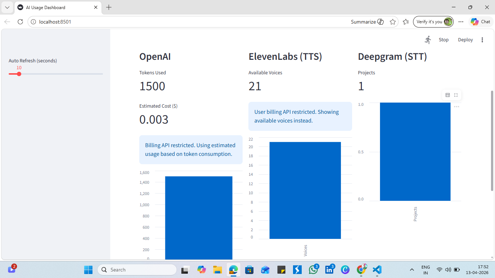
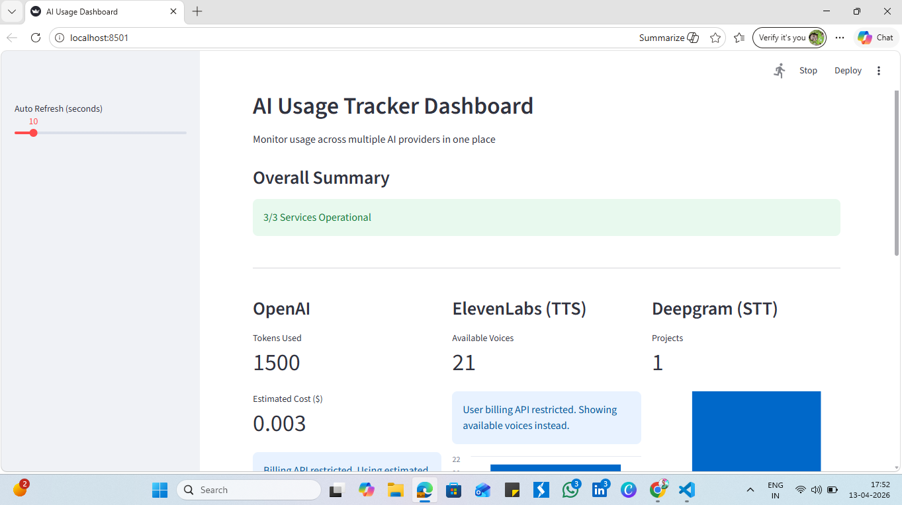
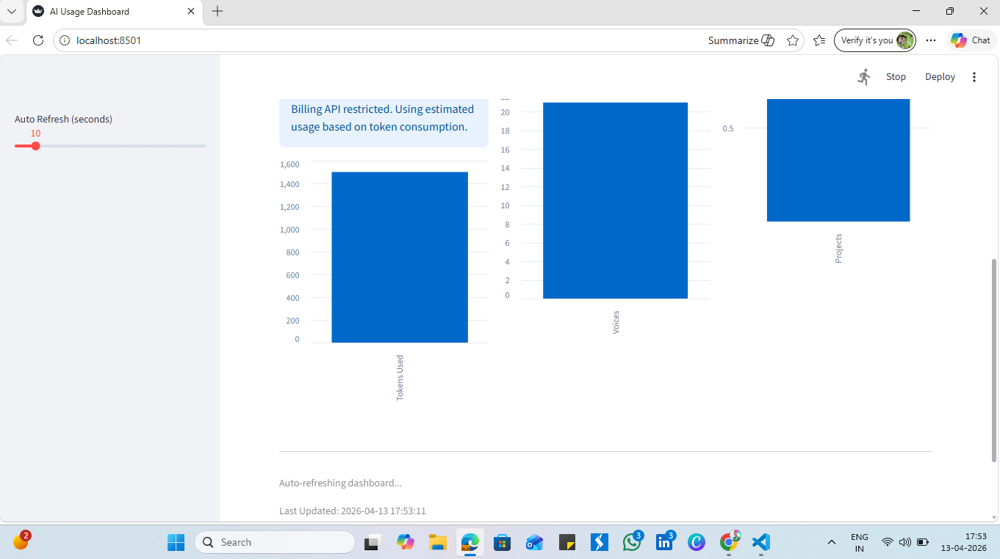

# AI Usage Tracker Pro

## Overview

AI Usage Tracker Pro is a full-stack dashboard designed to monitor usage across multiple AI service providers including OpenAI, ElevenLabs, and Deepgram. It provides real-time insights, usage metrics, and visualizations with intelligent fallback handling for restricted APIs.

---

## Features

* Integration with multiple AI providers:

  * OpenAI (LLM)
  * ElevenLabs (Text-to-Speech)
  * Deepgram (Speech-to-Text)
* FastAPI backend for API handling
* Streamlit dashboard for visualization
* Real-time auto-refreshing dashboard
* Usage metrics and charts
* Service health monitoring
* Error handling and fallback strategies for restricted APIs

---

## Architecture

Frontend (Streamlit) → Backend (FastAPI) → Service Layer → External APIs

---

## Tech Stack

* Python
* FastAPI
* Streamlit
* Requests
* Python-dotenv

---

## Setup Instructions

### 1. Clone the repository

```bash
git clone <your_repo_link>
cd AI_Usage_Tracker_Pro
```

### 2. Create virtual environment

```bash
python -m venv venv
venv\Scripts\activate
```

### 3. Install dependencies

```bash
pip install -r requirements.txt
```

### 4. Add environment variables

Create a `.env` file in the root directory and add:

```
OPENAI_API_KEY=your_openai_key
ELEVENLABS_API_KEY=your_elevenlabs_key
DEEPGRAM_API_KEY=your_deepgram_key
```

### 5. Run backend server

```bash
uvicorn app.main:app --reload
```

### 6. Run Streamlit dashboard

```bash
streamlit run dashboard.py
```

---

## Dashboard Features

* API usage per provider
* Estimated cost tracking (OpenAI)
* Available resources tracking (ElevenLabs)
* Project-level data (Deepgram)
* Charts and visual insights
* Auto-refresh for real-time updates

---

## Screenshots





---

## Demo Video

(Add google drive demo video link here)

---

## Author

Divya Malviya
